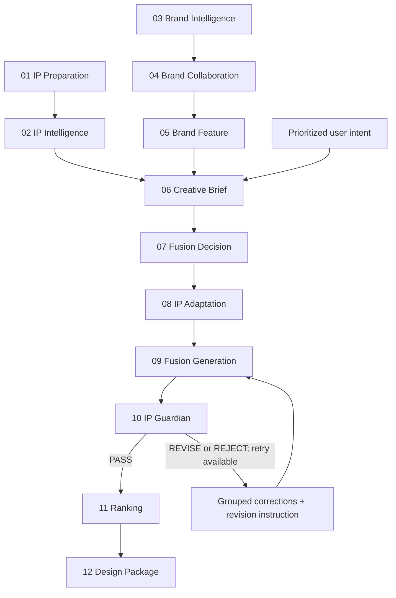

# Following blowing Agent Workflow

## Core product questions

The schema-v2 workflow contains exactly twelve agents. Four of them define the product narrative:

| Agent | Product question |
| --- | --- |
| IP Intelligence | **WHO IS THE CHARACTER?** |
| Fusion Decision | **HOW SHOULD THE CO-BRANDING WORK?** |
| IP Adaptation | **HOW SHOULD THE CHARACTER CHANGE?** |
| IP Guardian | **IS THE TRANSFORMATION STILL THE SAME IP?** |

IP Adaptation is the only new agent. Brand integration affordances remain in Brand Feature, and the fusion relationship remains in Fusion Decision.

## Twelve-agent DAG

The Luna AI Supplement is an optional intent aid before Creative Brief. It is not a thirteenth workflow agent and never overrides user input.

## Branch and merge contracts

The IP branch prepares the source asset and produces `IPDNA`, `IPIdentityGrammar`, and a legacy-compatible `IdentityLock` projection. The brand branch produces an image-grounded `BrandProfile`, sourced collaboration reasoning, and a `BrandFeaturePool` with integration affordances.

Creative Brief merges those branches with user intent. Its priority is fixed:

1. User free text.
2. User-selected goals.
3. Explicitly adopted AI supplement.

Fusion Decision selects the co-branding relationship. IP Adaptation then makes that relationship physically executable by defining pose, deformation, attachment, interaction, and occlusion behavior. Generation renders the plan; Guardian evaluates the result independently.

## Guardian retry loop

`MAX_GUARDIAN_RETRIES = 2`.

- `PASS` proceeds to Ranking and Design Package.
- `REVISE` or `REJECT` may return to Fusion Generation while retry budget remains.
- The retry reuses the approved brief, relationship, identity grammar, and adaptation plan, adding Guardian correction groups and a unified revision instruction.
- A retry does not silently rewrite user intent or rerun the whole DAG.
- When retry budget is exhausted without `PASS`, Ranking and Design Package do not run and the workflow ends in its existing non-success terminal path.

Python owns retry count, branch selection, checkpoint state, and the authoritative verdict.

## Completion contract

An agent may be marked `COMPLETED` only after all four conditions hold:

1. The provider call or deterministic operation succeeded.
2. Structured output validation succeeded.
3. The artifact and normalized result were persisted.
4. The checkpoint write succeeded.

Frontend animation is a projection of persisted workflow state and cannot complete an agent.

## Dependency invalidation

Invalidation uses the same DAG in demo and real-provider modes.

| Change | Invalidate |
| --- | --- |
| IP asset | IP Preparation, IP Intelligence, Creative Brief, Fusion Decision, IP Adaptation, Fusion Generation, IP Guardian, Ranking, Design Package |
| Brand asset | Brand Intelligence, Brand Collaboration, Brand Feature, Creative Brief, Fusion Decision, IP Adaptation, Fusion Generation, IP Guardian, Ranking, Design Package |
| User goal, free text, or adopted supplement | Creative Brief, Fusion Decision, IP Adaptation, Fusion Generation, IP Guardian, Ranking, Design Package |
| Fusion Decision result | IP Adaptation, Fusion Generation, IP Guardian, Ranking, Design Package |
| IP Adaptation result | Fusion Generation, IP Guardian, Ranking, Design Package |
| Generated candidate | IP Guardian, Ranking, Design Package |
| Guardian result | Ranking, Design Package |

No invalidation path may skip IP Adaptation between Fusion Decision and Fusion Generation.

## Checkpoint compatibility

- New competition runs use `workflow_schema_version = 2`.
- Historical runs without a version are treated as schema v1.
- A v1 run may be read safely and shown with compatibility warnings.
- If a v1 checkpoint lacks `ip_identity_grammar` or `ip_adaptation`, the engine invalidates IP Intelligence and its downstream results before new work continues.
- Compatibility code may project an old `IdentityLock` into a low-confidence grammar for inspection, but it must not fabricate a completed `IPAdaptationPlan`.
- Demo mode uses the same twelve-agent graph and the same schemas; it does not maintain a second demo-only workflow.

