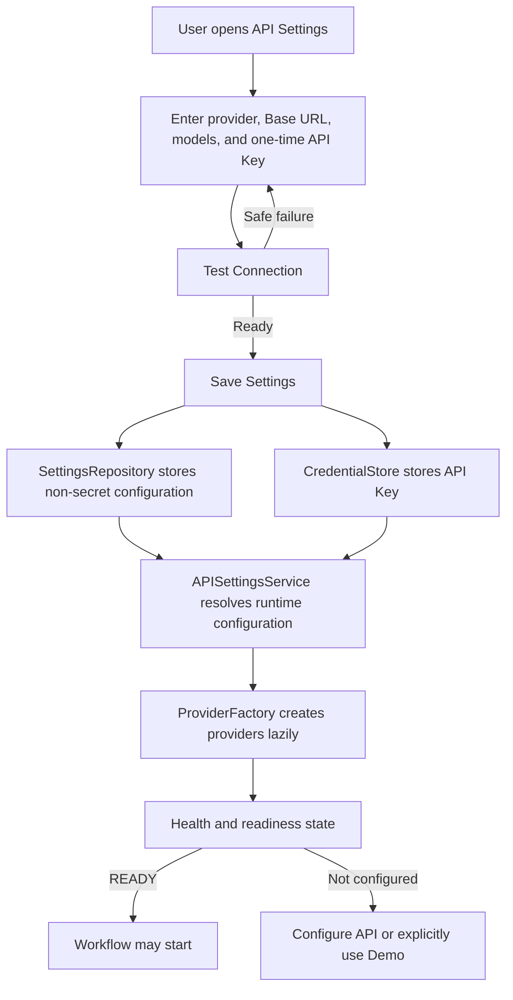

# BYOK API Settings Architecture

## Scope

API Settings adds runtime OpenAI-compatible Provider configuration without changing the 12-Agent workflow, schemas, checkpoints, Guardian, ranking, or export contracts.

BYOK Release contains no API credentials. Users configure FAST, MAIN, and IMAGE through the application. Search remains Demo / Mock in this release.

## Configuration lifecycle

The application must boot successfully when no credential exists. Provider clients are initialized lazily after configuration or immediately before a real model call.

## Responsibilities

### APISettingsService

Combines the non-secret settings and credential state into a runtime configuration. It enforces source precedence and returns browser-safe status such as configured, connected, error, or Demo.

It does not expose the raw Key to Agents, UI state, run state, or export code.

### SettingsRepository

Persists only non-secret values:

- Provider preset or provider type.
- Base URL.
- FAST model ID.
- MAIN model ID.
- IMAGE model ID.
- Fast, main, and image timeouts.

An operating-system-appropriate application-data location may be used. The API Key must never be added to this JSON or equivalent non-secret file.

### CredentialStore

Stores and deletes the API Key independently of non-secret settings.

Recommended keyring identity:

- Service: `following-blowing`
- Account: `provider-api-key`

On macOS this normally maps to Keychain; on Windows to Credential Manager; on Linux the active keyring backend decides storage.

If secure keyring storage is unavailable, the only fallback is session-only Python memory. The UI must state that the credential will disappear when the application session ends. There is no plaintext JSON fallback.

### ProviderFactory

Receives a resolved runtime configuration and creates the text and image Provider adapters lazily. Business Agents receive Provider interfaces; they do not access keyring, environment variables, Streamlit secrets, or user settings directly.

## Configuration precedence

1. Current user's BYOK settings.
2. Developer or administrator environment variables.
3. Administrator-provided Streamlit secrets for backward compatibility.
4. Explicit Demo Mode.

The BYOK distribution does not contain `.streamlit/secrets.toml`. The retained example is an empty developer/administrator compatibility template, not the normal user setup path.

## UI data boundary

API Settings uses one-time triggers for sensitive submission:

- `open_api_settings`
- `test_api_connection`
- `save_api_settings`
- `delete_api_credentials`
- `close_api_settings`

The API Key may be submitted to Python only with a one-time test or save trigger. It is not durable Component State. After Python consumes it, the next render returns only `credential_configured=true/false`; it never sends the Key back to JavaScript.

The browser must not persist the Key in localStorage, sessionStorage, HTML, JavaScript source, URL parameters, logs, or telemetry.

## Provider presets

The architecture is provider-neutral and OpenAI-compatible.

- **Custom OpenAI Compatible** leaves Base URL and model IDs under user control.
- **TeamoRouter** may suggest the public Base URL `https://api.teamorouter.com/v1` and recommended model IDs.

Preset selection never fills a credential. The API Key field remains empty until the user supplies their own value.

## Test Connection

The standard test is staged:

1. Check Provider reachability and call `GET /v1/models` when supported.
2. Validate that configured FAST, MAIN, and IMAGE model IDs are available or addressable.
3. Run a minimal FAST text request.
4. Run a minimal MAIN text request.
5. Validate image configuration without automatically generating an image.

An advanced image test is separately labeled, explicitly opt-in, and potentially billable.

Connection results expose model readiness but never the Key. Errors are bounded and browser-safe: authentication failure, unreachable Provider, missing model, unsupported request, or timeout. Raw authorization headers, provider payloads, credential substrings, machine-local paths, and full tracebacks are forbidden.

## Readiness and Demo

When live mode is selected but no credential is configured, Start Workflow is disabled and the UI links directly to API Settings.

Without credentials, users may explicitly select Demo Mode. The UI must continuously show `DEMO MODE` and must not imply a live Provider call. Demo shares the production DAG and deterministic contracts but uses bundled demo assets and mock Providers.

The status surface may show only non-secret readiness:

| Service | Example states |
| --- | --- |
| FAST | READY / NOT CONFIGURED / ERROR |
| MAIN | READY / NOT CONFIGURED / ERROR |
| IMAGE | READY / NOT CONFIGURED / ERROR |
| Search | DEMO |

## Credential deletion

Deleting credentials requires confirmation. The operation calls `CredentialStore.delete()` and clears any session-only copy. Clearing only the UI field is insufficient.

After deletion, the application returns to API-not-configured state. Live Workflow stays disabled until a new credential is tested and saved; Demo remains available.

## Security boundaries

The API Key is forbidden from:

- WorkflowRun and Agent results.
- Provider metadata exposed to the app.
- Run and workflow checkpoints.
- Prompt and workflow traces.
- Logs and browser-safe errors.
- HTML / JavaScript source and browser storage.
- Design Package, export ZIP, manifests, and hashes.

Non-secret Provider names, Base URLs, model IDs, timeouts, readiness flags, and prompt/model provenance may be recorded where required for reproducibility.

The release must pass a credential-pattern scan and a targeted data-flow test before distribution. Placeholder names such as `API_KEY` are acceptable in an empty administrator template; non-empty secret values are not.

## Current capability boundaries

- API Settings configures FAST, MAIN, and IMAGE only.
- Search remains Demo / Mock.
- Standard connection testing does not generate an image.
- Single-reference image editing is the supported target route.
- Multiple-reference image editing remains `UNVERIFIED`.

