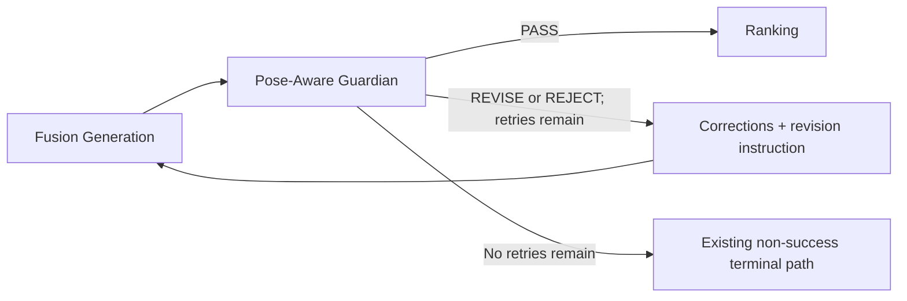

# Pose-Aware IP Guardian

## Responsibility

The Guardian answers: **IS THE TRANSFORMATION STILL THE SAME IP?**

It compares two ordered images:

1. Image 1 is the original IP reference.
2. Image 2 is the generated candidate.

It also receives `IPIdentityGrammar`, the compatibility lock when present, `CreativeBrief`, `FusionRelationship`, `IPAdaptationPlan`, and prioritized user intent. Terra returns structured visual checks and reasons. Python calculates the score and verdict.

## Identity checks and weights

| Check | Weight |
| --- | ---: |
| `original_ip_recognition` | 25% |
| `identity_anchor_consistency` | 20% |
| `facial_relationship_consistency` | 15% |
| `structural_grammar_consistency` | 15% |
| `proportion_signature_consistency` | 10% |
| `line_style_grammar_consistency` | 10% |
| `valid_pose_deformation` | 5% |

Terra returns a 0–100 value and visible reason for each check. Python applies:

```text
identity_score =
    original_ip_recognition * 0.25
  + identity_anchor_consistency * 0.20
  + facial_relationship_consistency * 0.15
  + structural_grammar_consistency * 0.15
  + proportion_signature_consistency * 0.10
  + line_style_grammar_consistency * 0.10
  + valid_pose_deformation * 0.05
```

The weighted result is rounded only by the deterministic scoring function.

## Independent compliance gates

The following checks are not folded into `identity_score`:

- `target_pose_compliance`
- `user_intent_compliance`
- `brand_integration_compliance`

Each gate must be at least 75 for `PASS`.

## Authoritative verdict

Python applies the verdict in this order:

1. Severe forbidden drift → `REJECT`.
2. `identity_score < 75` → `REJECT`.
3. `75 ≤ identity_score < 85` → `REVISE`.
4. `identity_score ≥ 85` and any compliance gate is below 75 → `REVISE`.
5. `identity_score ≥ 85` and all three gates are at least 75 → `PASS`.

Any qualitative verdict returned by Terra is compatibility data only. It cannot override Python.

## Legal transformation

Guardian does not penalize change merely because it differs from the source pose. It accepts grammar-consistent changes to pose, view, limbs, body orientation, bounded expression, clothing, attachment, overlap, product handling, behavior, and role.

Examples:

- A side-view candidate can pass when facial and ear relationships project coherently.
- A waving character can pass even though its silhouette and limb position differ.
- A sitting candidate can pass when topology and proportion signatures remain characteristic.
- A same-pose candidate can fail when its eyes, nose-mouth grammar, ears, proportions, or line language drift.

## Forbidden drift

Forbidden drift is a change to identity grammar rather than state. The assessment records both `forbidden_drift_detected` and `severe_forbidden_drift`.

Severe cases include an unmistakably different species or character, replaced core facial grammar, broken structural topology, loss of defining anchors, or an unrelated rendering language that destroys recognition.

Ordinary repairable deviations lower their relevant checks and generate corrections; they do not automatically become severe.

## Correction contract

When correction is needed, Terra groups it into:

- `identity_corrections`
- `pose_corrections`
- `brand_corrections`
- `style_corrections`

It also returns one unified `revision_instruction`. Corrections must be specific, visually actionable, and compatible with higher-priority user intent. “Restore the original pose” is not the default repair for a legal target-pose transformation.

## Retry loop



The maximum Guardian retry count is two. Python increments and persists the count, validates each new artifact, and prevents Ranking from receiving a non-PASS candidate.

