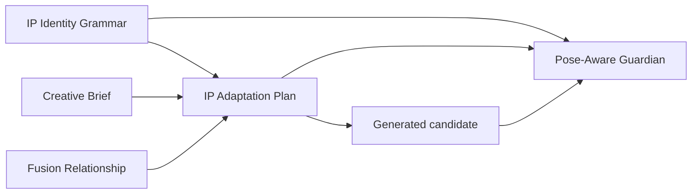

# IP Identity Grammar

## Core principle

> Identity Preservation ≠ Pose Preservation

Feature extraction exists to support legal character transformation, not to prohibit change. Following blowing protects the relationships that make a character recognizable while allowing pose, viewpoint, limbs, expression, clothing, and interaction to change.

An original image is therefore an identity reference. It is not a frozen silhouette, pixel template, or mandatory pose.

## What the grammar protects

`IPIdentityGrammar` organizes identity evidence into reusable rules:

| Grammar group | Purpose |
| --- | --- |
| `character_type` | Grounded description of the depicted character or species category |
| `core_identity_anchors` | Minimum identity-bearing features that must remain legible |
| `relational_geometry` | Stable relationships among face, head, body, and features |
| `structural_topology` | How parts connect and which parts exist |
| `proportion_signature` | Characteristic size and ratio relationships |
| `line_style_grammar` | Stroke economy, contour behavior, and rendering language |
| `facial_grammar` | Eye and nose-mouth relationships that define recognition |
| `ear_grammar` | Ear shape, placement, orientation behavior, and relation to the head |
| `limb_grammar` | Limb construction and articulation rules |
| `immutable_features` | Features that must not be redesigned |
| `mutable_features` | Features that can change without identity loss |
| `pose_dependent_features` | Features whose projection or placement must change with pose or view |
| `forbidden_drift` | Specific changes that would produce a different character |
| `unknowns` and `confidence` | Explicit limits of what the source image proves |

The grammar also includes transformation rules for pose, viewpoint, expression, accessories, clothing, and occlusion.

## Three transformation classes

### Identity anchors

Identity anchors must remain recognizable across legal transformations. They are not necessarily fixed pixel locations; their defining shape and relationships are what remain stable.

Examples include a distinctive eye relationship, economical nose-mouth construction, characteristic ear placement, head-to-body ratio, or a specific contour language.

### Deformable features

Deformable features may change naturally to execute an action. Clothing folds, limb angle, expression intensity, and visible body contour can vary when the underlying grammar remains intact.

### Pose-dependent features

Pose-dependent features must move or project differently under a new pose. A side view changes overlap and apparent spacing; a raised arm changes silhouette; sitting changes the body axis and leg visibility. Freezing those features would make the target action anatomically incoherent.

## Legal transformation

A transformation is legal when it changes the character's state while preserving identity grammar.

| Legal change | Required protection |
| --- | --- |
| Sitting, running, waving, holding, embracing, or lying down | Structural topology, limb grammar, proportions, and identity anchors |
| Frontal, side, or three-quarter view | View-dependent projection of facial, ear, and relational grammar |
| Bounded expression change | Eye and nose-mouth grammar remain characteristic |
| Apparel or headwear | Approved attachment surfaces and readable identity anchors |
| Product interaction or role behavior | Coherent contact, scale, action, and occlusion |
| Graphic or color application | Original line grammar and identity-bearing contrast remain legible |

A changed silhouette caused by a valid pose is not, by itself, identity drift.

## Forbidden drift

Forbidden drift changes who the character is rather than what the character is doing. Typical cases include:

- Replacing the observed facial relationships with generic anime or realistic animal anatomy.
- Replacing ear grammar with unrelated ear shape, placement, or scale.
- Changing the structural topology, species cues, or defining proportions.
- Adding unsupported anatomy or hidden features.
- Replacing the original line language with realistic fur, generic 3D rendering, or an unrelated cartoon style.
- Allowing products, hands, clothing, or graphics to obscure enough anchors that the source IP is no longer recognizable.

## From intelligence to adaptation

IP Intelligence answers who the character is and emits the grammar. Creative Brief states what the user wants. Fusion Decision defines the co-branding relationship. IP Adaptation combines those contracts into a target pose and deformation plan:

The adaptation plan must state what to preserve, what to transform, what is pose-dependent, and what is forbidden. `HIGH` transformation explicitly requires meaningful re-posing rather than brand overlays on the original pose.

## Attachment and occlusion

- Accessories attach only to surfaces supported by the source anatomy and grammar.
- Clothing adapts to the new body axis and limb motion; it must not replace body topology.
- Held products need explicit hand or limb contact, scale, and interaction behavior.
- Occlusion rules identify which anchors must remain visible and which overlaps are natural.
- Unknown anatomy remains unknown. Neither adaptation nor generation may invent an unsupported tail, limb, muzzle, ear, or attachment surface.

## Legacy IdentityLock compatibility

`IdentityLock` remains a deprecated checkpoint and export compatibility projection. It can summarize locked, allowed, and forbidden changes, but new reasoning uses `IPIdentityGrammar`.

When restoring a schema-v1 checkpoint, the system may build a conservative, low-confidence grammar for safe display. That projection must include pose and viewpoint as potentially legal changes and must carry a compatibility warning. Before a new schema-v2 workflow continues, IP Intelligence and downstream artifacts are invalidated so Terra can produce a native grammar. A legacy lock must never be used to fabricate a completed adaptation result.

